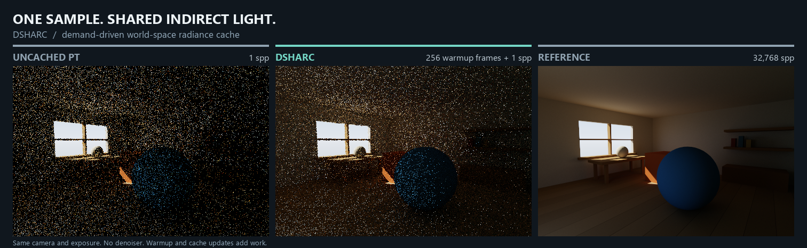

# DSHARC

**Demand-driven diffuse radiance caching for path tracers.**

Trace path prefixes, merge their indirect-hit requests in a world-space hash grid,
and shade each active cell once per frame. Many paths share the same cached tail.



*Actual sample renders. DSHARC keeps 256 warmup frames of cache history, then starts
a fresh 1-spp image. Same exposure, no denoiser. Warmup and cache updates are extra work.*

## How it works


- **Demand-driven:** rendering paths allocate the cells they need; matching requests share an update.
- **Frame-frozen feedback:** cell updates read previous-frame radiance; resolved results finish this frame's paths.
- **Small integration surface:** four HLSL headers, no engine dependency. The renderer supplies tracing and materials.

Unlike SHARC's sparse update paths, DSHARC shades a compacted set of surface
representatives. This is a **biased diffuse approximation**, with a SlangPy sample
that compares DSHARC, NVIDIA SHARC and uncached PT on D3D12 and Vulkan.

[NVIDIA SHARC](https://github.com/NVIDIA-RTX/SHARC) is included in
[`sample/SHARC`](sample/SHARC) solely as a quality and performance comparison
baseline. Its [license](sample/SHARC/License.md) and copyright notices are
preserved; DSHARC's standalone headers do not depend on it.

## Try it

```powershell
python -m venv sample/.venv
./sample/.venv/Scripts/python.exe -m pip install -r sample/requirements.txt
./sample/.venv/Scripts/python.exe sample/entry_point.py --renderer dsharc
```

Use the **REFERENCE / SHARC / DSHARC** buttons to compare. Requires a ray-query
GPU with 64-bit buffer atomics; the standalone headers target HLSL SM 6.6.
[Sample setup, controls and Vulkan usage →](sample/README.md)

## Current results

Diffuse room, RTX 5080, 480×320; caches prewarmed for 256 frames. Error is linear
luminance RMSE divided by the high-spp reference's mean luminance.

| | Uncached PT | SHARC | DSHARC |
| --- | ---: | ---: | ---: |
| 1 spp error | 161.66% | 129.58% | **123.93%** |
| 32 spp error | 28.62% | 22.55% | **21.65%** |
| Warm 1 spp frame cost¹ | **0.22 ms** | 0.34 ms | 0.81 ms |

DSHARC's mean luminance difference at 32,768 spp is **+0.011%** in this scene.
The current implementation favors correctness: missing cache tails fall back to
PT, and every live cell is refreshed. **Lower error here does not yet mean better
performance.** ¹End-to-end batch throughput, including CPU submission; not GPU-only timing.

[Integration guide](docs/Integration.md) · [Measurements & reproduction](sample/DSHARC_INTEGRATION.md) ·
[Tests](docs/Validation.md) · [Design references & third-party code](docs/References.md)
