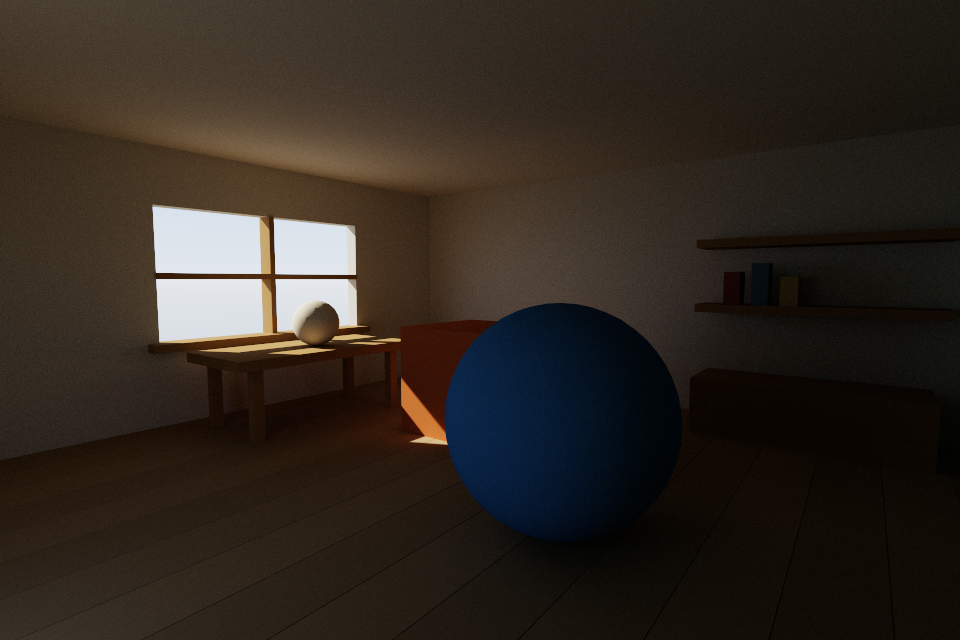

# Slang Path Tracer Sample

A standalone Python + SlangPy path tracer with skylight and a finite solar disk.
Its structure follows [WeakKnight/Nan](https://github.com/WeakKnight/Nan): Python
owns the scene, acceleration structures and frame loop; Slang compute shaders
trace paths with hardware inline ray queries. Rendering is split into path
tracing, accumulation and tone mapping passes.



[NVIDIA SHARC](https://github.com/NVIDIA-RTX/SHARC) is bundled in [`SHARC/`](SHARC/)
solely as a quality and performance comparison baseline, under its original
[license](SHARC/License.md). DSHARC's standalone headers do not depend on it.
SHARC is enabled by default, with the original uncached path tracer
available through `--renderer reference`. Our DSHARC is available through
`--renderer dsharc`; the panel has REFERENCE / SHARC / DSHARC buttons.
See [SHARC integration](SHARC_INTEGRATION.md) and
[DSHARC integration, measured error and cost](DSHARC_INTEGRATION.md).
Update-path cache resampling is enabled. Use `compare_low_spp.py` to compare
32-spp cold/warm SHARC images against uncached PT and a high-spp target.

## Requirements and setup

- Python 3.10 or newer; tested with Python 3.12 and SlangPy 0.43.1.
- A DXR-capable GPU and current D3D12 drivers on Windows, or a GPU/driver with
  Vulkan acceleration structures and ray queries.
- SHARC additionally uses native float16 storage and 64-bit buffer atomics.
  Slang emits native types for both backends; reflected buffer strides are checked.
  Initialization failure prints the error and falls back to reference PT.
- SlangPy supplies the Slang compiler and GPU runtime. No separate Slang SDK,
  CMake build or Nan checkout is required.

From the repository root on Windows:

```powershell
python -m venv sample/.venv
./sample/.venv/Scripts/python.exe -m pip install -r sample/requirements.txt
./sample/.venv/Scripts/python.exe sample/entry_point.py
```

On Linux, use `sample/.venv/bin/python` and `--backend vulkan`. Only Windows has
been exercised here. Commands resolve shader paths relative to the sample, so
the process working directory does not need to be `sample/`.

## Interactive mode

The default scene is an 8 × 8 m room with a 3.4 m ceiling and 2,116 triangles.
A side window and a small doorway are the only openings in the opaque shell.
Window mullions, a table, shelving, a cabinet and colored objects create sheltered
regions and diffuse color bleeding. The camera starts inside the room, looking
toward the window and back wall; the ceiling stays in place during rendering.
It does not download any scene assets.

Sunlight directly reaches a small part of the room, while the ceiling, furniture
undersides and most back-facing surfaces rely on reflected illumination. This is
used for the SHARC/reference comparisons below. The default uses a 32-bounce cap
and +1 EV exposure; cached paths usually terminate much earlier.
For a cleaner indoor reference, render 1,024 or more spp; `preview.png` uses 2,048.

| Control | Action |
| --- | --- |
| Hold right mouse button and drag | Look around |
| W / A / S / D | Move |
| Q / E | Move down / up |
| Shift | Move faster |
| R | Reset accumulated samples and SHARC cache |
| F2 / Save PNG | Save the current image to `--output` |
| Escape | Close the window |

The panel controls solar azimuth/elevation, irradiance, angular radius, sky
intensity, exposure, bounce count and renderer selection. Camera, lighting,
mode and bounce changes reset both image and cache. Exposure is a display-only change and preserves
linear-radiance history. Resizing allocates new textures and restarts accumulation.
**Reset image (keep cache)** restarts only image accumulation with fresh RNG
samples; it is useful for inspecting low-spp images after cache warm-up.

## Headless rendering

```powershell
# 256 samples per pixel, progressive one-sample frames
./sample/.venv/Scripts/python.exe sample/entry_point.py --headless `
  --width 960 --height 640 --frames 256 --output sample/output/render.png

# Eight samples per frame: 32 * 8 = 256 spp
./sample/.venv/Scripts/python.exe sample/entry_point.py --headless `
  --frames 32 --spp 8 --max-bounces 8 `
  --sun-elevation 25 --sun-azimuth -60 --sun-radius 1.5 `
  --output sample/output/evening.png --linear-output sample/output/evening.npy

# Sky-only / sun-only comparisons
./sample/.venv/Scripts/python.exe sample/entry_point.py --headless --sun-intensity 0 `
  --output sample/output/sky-only.png
./sample/.venv/Scripts/python.exe sample/entry_point.py --headless --sky-intensity 0 `
  --output sample/output/sun-only.png

# Compare short paths against multiple reflected bounces, with the same seed
./sample/.venv/Scripts/python.exe sample/entry_point.py --headless --renderer reference `
  --frames 128 --spp 8 --max-bounces 1 --output sample/output/one-bounce.png
./sample/.venv/Scripts/python.exe sample/entry_point.py --headless --renderer reference `
  --frames 128 --spp 8 --max-bounces 8 --output sample/output/eight-bounces.png

# Optional mesh import and explicit camera
./sample/.venv/Scripts/python.exe sample/entry_point.py --scene path/to/scene.glb `
  --camera-position 8 5 10 --camera-target 0 1 0
```

PNG output is exposed, filmic-tone-mapped and sRGB encoded. The optional `.npy`
contains unexposed linear float32 RGB with shape `(height, width, 3)`; use that
array for numerical comparisons. A display PNG cannot preserve HDR radiance.

| Option | Default | Meaning |
| --- | --- | --- |
| `--backend` | `d3d12` on Windows | `d3d12` or `vulkan` |
| `--width`, `--height` | 960, 640 | Render size |
| `--frames` | 128 | Number of headless frames |
| `--spp` | 1 | Samples per pixel per frame, 1–64 |
| `--max-bounces` | 32 | Reference/query scattering cap, 1–32; cache update always traces up to 32 |
| `--renderer` | `sharc` | `sharc`, `dsharc` or `reference` |
| `--dsharc-capacity` | 1048576 | DSHARC entries; 140 MiB plus path records |
| `--dsharc-cell-size` | 0.025 | Smallest cell size in world units |
| `--dsharc-history` | 256 | Maximum temporal history frames |
| `--sharc-capacity` | 4194304 | Hash table entries; 160 MiB for the three buffers |
| `--sharc-downscale` | 5 | Update every 5×5 pixel stratum, jittered each sample |
| `--sharc-grid-scale` | 80 | Larger means smaller world-space cells |
| `--sharc-history` | 256 | SDK temporal history window, 1–1024 frames |
| `--sharc-radiance-scale` | 65536 | Integer accumulation precision; lower for very bright scenes |
| `--seed` | 1 | Reproducible uint32 RNG seed |
| `--sun-azimuth` | -65 | Degrees; 0 points toward +Z, 90 toward +X |
| `--sun-elevation` | 35 | Degrees above the XZ plane |
| `--sun-intensity` | 3 | Solar irradiance on a surface perpendicular to its axis |
| `--sun-radius` | 0.26785 | Angular radius in degrees, 0.05–30 |
| `--sky-intensity` | 0.7 | Sky radiance multiplier |
| `--exposure` | 1 | Display exposure in EV |
| `--fov` | 65 | Vertical field of view in degrees |
| `--scene` | Built-in room | A triangle scene supported by trimesh |
| `--scene-scale` | 1 | Uniform geometry scale |
| `--camera-position`, `--camera-target` | Scene-dependent | Supply both as XYZ triples |
| `--output` | `sample/output/render.png` | Display image path |
| `--linear-output` | Disabled | Optional `.npy` radiance path |
| `--vsync` | Disabled | Enable presentation synchronization |
| `--debug` | Disabled | Enable graphics API validation |

## Rendering model

- **Geometry:** static opaque triangles, flattened into world space, one BLAS
  and one identity-instance TLAS. Ray queries handle both visibility and path hits.
- **Materials:** two-sided Lambert reflectors with optional emission. The built-in
  spheres use smooth normals; box edges stay flat. Optional SHARC/DSHARC, no denoiser.
- **Sky:** a procedural, direction-dependent zenith/horizon/ground radiance model.
  It illuminates geometry through BSDF-sampled escape rays, including indirect
  paths. It is deliberately a small analytic model, not Nan's atmospheric LUTs;
  solar elevation does not automatically alter sky intensity or colors.
- **Sun:** a constant-radiance spherical cap at infinity. Uniform-cone NEE casts
  actual shadow rays and produces finite-source penumbrae. The disk is also
  visible to camera rays and BSDF-sampled escape rays.
- **MIS:** a power heuristic combines solar NEE and BSDF hits on the solar disk.
  It does not downweight the sky, which has no competing NEE estimator. This
  avoids counting sunlight twice while preserving camera-visible solar radiance.
- **Transport:** cosine-weighted diffuse sampling, jittered pixel rays, emission,
  Russian roulette after four scattering events, and an explicit path-depth cap.
  The final path segment still evaluates environment/emission. The depth cap
  intentionally truncates longer transport in reference mode. SHARC replaces a
  continuation with a cached tail; use a 32-bounce reference when comparing it,
  not a deliberately truncated one/eight-bounce reference.
- **History:** sample-count-weighted running mean in an FP32 texture, reset on
  scene-view/lighting changes; tone mapping and sRGB encoding happen afterward.

For solar angular radius `r`, emitted radiance is
`sun_color * sun_intensity / (PI * sin(r)^2)`. Keeping intensity fixed while
enlarging the disk therefore preserves perpendicular irradiance while softening
shadows. The shader uses the corresponding solid-angle PDF `1/(2*PI*(1-cos(r)))`.

Imported scenes preserve node transforms, repeated nodes, material base factors,
emissive factors and face/vertex colors. Texture maps, UV material sampling,
normal maps, alpha cutouts, metallic/specular/transmission, skinned animation and
authored hard-edge normals on imported meshes are not implemented. Imported smooth
normals are regenerated from geometry. A textured asset prints a warning and uses
its factors only; it is not expected to match a full glTF PBR viewer. The loader is
intended for small baseline scenes, since flattening duplicates instanced geometry.

## Files

| File | Role |
| --- | --- |
| `entry_point.py` | CLI and validation |
| `app.py` | Device, UI/window, camera input, headless loop |
| `camera.py` | Camera basis and movement |
| `scene.py` | Built-in/imported triangles and BLAS/TLAS construction |
| `renderer.py` | Compute passes, reset logic, lighting parameters and export |
| `sharc.py` | Reflected SDK resources, settings and Update/Resolve/Query scheduling |
| `dsharc.py` | Demand-cache resources, indirect update dispatch and radiance ping-pong |
| `shaders/common.slang` | Camera, RNG, sampling and MIS |
| `shaders/scene.slang` | Hit reconstruction and shadow queries |
| `shaders/lighting.slang` | Sky and solar disk evaluation |
| `shaders/path_tracer.slang` | Unidirectional path tracing megakernel |
| `shaders/sharc_*.slang`, `sharc_bridge.slangh` | SDK permutations, resolve and shared integration policy |
| `shaders/dsharc_*.slang`, `dsharc_bridge.slangh` | Request, management, material/lighting, resolve and gather |
| `shaders/accumulator.slang` | Linear radiance accumulation |
| `shaders/tone_mapper.slang` | Filmic curve and sRGB output |
| `test_sample.py` | CPU and actual GPU checks |
| `test_sharc.py` | Cached diffuse energy, room bias, coverage and reset tests |
| `compare_sharc.py` | Independent-seed HDR convergence comparisons and image exports |
| `compare_low_spp.py` | 1/4/8/16/32-spp cold/warm cache comparison against high-spp PT |
| `test_dsharc.py` | GPU energy, demand, feedback, empty-list, overflow-fallback and reset tests |
| `benchmark_caches.py` | Warm end-to-end batch timing for all three renderers |

## Validation

```powershell
./sample/.venv/Scripts/python.exe sample/test_sample.py --backend d3d12
./sample/.venv/Scripts/python.exe sample/test_sample.py --backend vulkan
./sample/.venv/Scripts/python.exe sample/test_sharc.py --backend d3d12
./sample/.venv/Scripts/python.exe sample/test_sharc.py --backend vulkan
./sample/.venv/Scripts/python.exe sample/test_dsharc.py --backend d3d12
./sample/.venv/Scripts/python.exe sample/test_dsharc.py --backend vulkan
./sample/.venv/Scripts/python.exe sample/compare_sharc.py --width 480 --height 320 `
  --frames 1024 --spp 32 --output sample/output/sharc_comparison
# Add --cache dsharc to compare our cache against high-spp PT.
./sample/.venv/Scripts/python.exe sample/compare_low_spp.py --dsharc
./sample/.venv/Scripts/python.exe sample/benchmark_caches.py
```

Tests cover geometry/camera consistency, glTF node transforms, argument validation,
black output with lights off, analytic Lambert energy under uniform sky, solar MIS
energy, a camera-visible solar disk, shadow occlusion, extra-bounce illumination,
weighted accumulation, deterministic reset, camera/light/resize changes and PNG/HDR
array export. These are GPU rendering tests, not just shader compilation checks.

For a short minimized-window startup/presentation test, use
`--window-frames 3 --width 480 --height 320`. It closes after three presented frames.
SHARC checks also exercise a closed RGB emissive furnace with an analytic unit
radiance solution, room bias with a minimum actual cache-use requirement, black
materials, light/camera/grid/mode/resize invalidation, and odd-sized update tiles.
Performance depends on GPU, scene and sampling settings; convergence render wall
times are not an equal-error, warmed GPU performance benchmark.

## Reference

Examined [Nan at `97909ff`](https://github.com/WeakKnight/Nan/tree/97909ff6b9d43fb5da7b85f27a22b7793a78bddd),
particularly `path_tracer.py`, `path_tracer.slang`, `scene.py`, `app.py`,
`accumulator.py` and `tone_mapper.py`. This sample is self-contained and does not
copy Nan's shadow/cache experiments or depend on a sibling checkout.
